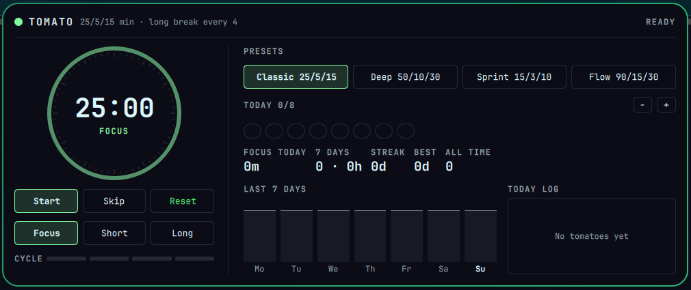

# Tomato for Omarchy

A pomodoro focus timer that lives in the Omarchy bar (`nixfred.tomato`).



Bar widget: a ring that empties as the phase runs down, with minutes left beside it (or today's tomato count when idle).


## Controls

| Where | Action |
|---|---|
| Bar, left click | Start, pause or resume |
| Bar, right click | Open the panel |
| Bar, middle click | Skip the current phase |
| `qs ipc call tomato toggle` | Open or close the panel (bind it to a key) |

The panel has everything on one screen: the dial, Start/Skip/Reset, direct Focus/Short/Long starts, four presets (Classic 25/5/15, Deep 50/10/30, Sprint 15/3/10, Flow 90/15/30), today's tomatoes against a daily goal, focus minutes, 7-day count and hours, current and best streak, a 7-day bar chart with the goal line, and today's session log (the only thing that scrolls, inside its own box). Every button has a tooltip.

## Behaviour

- Breaks start on their own when a focus phase ends. After a break the timer waits for you, so an idle timer never rings.
- A long break comes after every 4 focus sessions.
- `notify-send` fires on every phase end.
- Skipping a focus phase never counts it.
- State and history live in `~/.local/share/tomato/state.json`. A running phase is stored as an end timestamp, not a countdown, so the timer survives a shell restart or a reboot. If the machine slept through a whole break, the missed break is not rung later.

## Install

```bash
cp -r manifest.json Service.qml BarWidget.qml TomatoPanel.qml bin ~/.config/omarchy/plugins/nixfred.tomato/
omarchy plugin enable nixfred.tomato right
omarchy restart shell
```

Needs only `python3` (stdlib) and `notify-send`, both present on a stock Omarchy install. No bun, no pip.

## CLI

`bin/tomato` is the engine and can be used from a terminal. Every command prints the full state as JSON.

```
tomato status | toggle | start [focus|short|long] | skip | reset
tomato preset FOCUS SHORT LONG | goal N | clear-today
```

## Screenshots

- `docs/panel.png`, `docs/bar.png`: live on gus (5120x1440), fresh install with no history.
- `docs/test-drive-panel.png`: Test Drive VM (Omarchy 4.0.2) with a running focus phase and seeded test history.

## License

MIT
